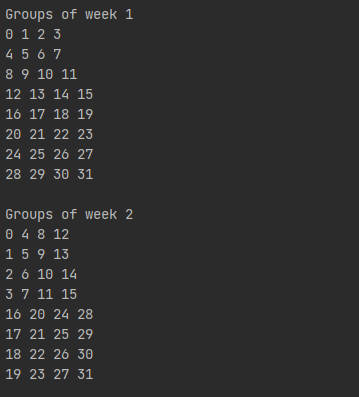

# Social Golfers Problem Solver with the Backtracking Technique

To execute the solver run the Main method on the SocialGolferProblem class.

A view of the beginning of the solution

The backtracking technique is implemented in the generateWeek method. The generatedWeek aims to generate a weekly 
schedule for a group of players. It starts by initializing an empty list called "week" to store the schedule. Then, 
it uses nested loops to form groups of players based on certain conditions. If a group meets the required criteria, 
it is added to the week. If the generated week is incorrect, it reverts to the previous state and recursively tries 
again until a valid week is obtained. The code ensures that players are not repeated within the same week.

After we get the matrix that contains the connections between the players in the specified weeks we generate the
equivalent graph which we travers with the DFS and BFS methods.